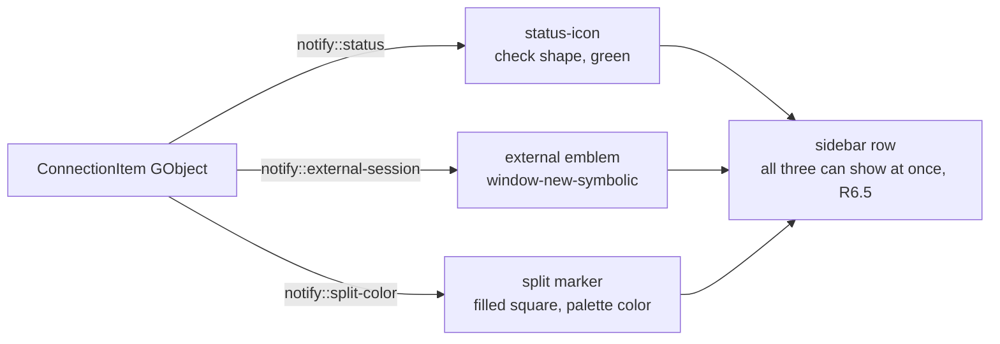

# Design Document

## Overview

This design implements external session tracking for RustConn 0.18.3, closing issue #209 and adding the related UX improvements. It removes the "dead" notebook tab that VNC/RDP/SPICE connections leave behind when their display is delegated to an external viewer process, and instead surfaces those sessions in the sidebar. It also generalizes sidebar state indication (Phase 2) and makes double-click focus an existing session rather than spawning a duplicate.

The work is split into two phases inside one release:

- **Phase 1 (Requirements 1–5, 8)** — the shippable #209 fix: a GUI-free predicate decides tab suppression, an `ExternalSessionRegistry` tracks external viewer processes, one shared poll timer detects exit, the sidebar shows a "connected" state plus an external-viewer emblem, and a context menu offers Disconnect / Stop tracking.
- **Phase 2 (Requirements 6, 7)** — the UX layer: orthogonal (icon + shape, color-independent) sidebar indicators including a split-color marker, and a smart double-click that focuses an existing session.

Design principle: the *decision* logic lives in `rustconn-core` (GUI-free, unit-testable); all GTK/process handling lives in `rustconn`. No new crate, no settings toggle (YAGNI, Requirement 8.7).

## Architecture

### Launch decision and tracking flow

```mermaid
flowchart TD
    A[User double-clicks / Connect] --> B[start_connection_with_split]
    B --> C{Connection.uses_external_viewer\n(rustconn-core predicate)}
    C -- false --> D[Existing embedded path\ncreate tab / widget]
    C -- true --> E[Spawn external viewer process]
    E -- spawn ok --> F[ExternalSessionRegistry.register\nchild + connection_id + history_entry_id]
    E -- spawn err --> G[No tab + error toast\nR1.6]
    F --> H[increment_session_count\n+ set_external_session true\n+ record_connection_start]
    F --> I[Shared poll timer 2s]
    I -->|child exited| J[decrement_session_count\n+ clear emblem\n+ record_connection_end]
    I -->|registry empty| K[Stop timer]
    subgraph sidebar
      H
      J
    end
```

### Sidebar indicator model (Phase 2)



Each indicator uses a distinct shape so the row stays readable in grayscale (Requirement 6.4): check mark = connected, window emblem = external viewer, small filled square = split membership.

## Components and Interfaces

### 1. Core predicate — `rustconn-core` (Requirements 1.2, 1.3, 8.1)

Add a pure, deterministic predicate next to `WindowMode` in `rustconn-core/src/models/connection.rs`. It governs only the **up-front** decision.

```rust
impl Connection {
    /// Returns true when the connection's display is fully delegated to a
    /// separate external viewer process (no embedded widget/tab).
    ///
    /// VNC/RDP honour both `window_mode == External` and a protocol
    /// `client_mode == External`; SPICE is always external (the embedded
    /// SPICE client was removed in 0.18.0).
    #[must_use]
    pub fn uses_external_viewer(&self) -> bool {
        match &self.protocol_config {
            ProtocolConfig::Spice(_) => true,
            ProtocolConfig::Vnc(c) => {
                self.window_mode == WindowMode::External
                    || c.client_mode == VncClientMode::External
            }
            ProtocolConfig::Rdp(c) => {
                self.window_mode == WindowMode::External
                    || c.client_mode == RdpClientMode::External
            }
            _ => false,
        }
    }
}
```

Runtime-fallback nuance (Requirement 1.4): embedded VNC may still fall back to an external viewer inside `rustconn/src/session/vnc.rs::connect_external_with_config`. That late fallback is *not* governed by this predicate — the tab already exists and keeps its "Session running in external window" placeholder. Only the up-front path suppresses the tab.

### 2. `ExternalSessionRegistry` — `rustconn`, new module (Requirements 2, 3, 4, 5)

New file `rustconn/src/external_session.rs`. It is intentionally separate from `external_window.rs` (which reparents VTE terminals into RustConn-owned windows — a different concept).

```rust
pub struct ExternalSession {
    connection_id: Uuid,
    /// `None` = viewer RustConn does not own (detaching viewer) — cannot be killed.
    child: Option<std::process::Child>,
    history_entry_id: Option<Uuid>,
    ended: bool,
}

/// Callbacks into sidebar/state, injected at construction to keep this
/// module free of direct sidebar/state coupling (same pattern as other
/// coordinators).
pub struct ExternalSessionCallbacks {
    pub on_registered: Box<dyn Fn(Uuid /*connection_id*/)>,   // increment + emblem on + history start
    pub on_ended: Box<dyn Fn(Uuid /*connection_id*/, Option<Uuid> /*history_entry_id*/)>, // decrement + emblem off + history end
}

pub struct ExternalSessionRegistry {
    sessions: Rc<RefCell<HashMap<Uuid /*session_id*/, ExternalSession>>>,
    callbacks: Rc<ExternalSessionCallbacks>,
    timer_running: Rc<Cell<bool>>,
}

impl ExternalSessionRegistry {
    pub fn new(callbacks: ExternalSessionCallbacks) -> Rc<Self>;
    /// Registers a spawned viewer, fires on_registered, ensures the poll timer runs.
    pub fn register(self: &Rc<Self>, session_id: Uuid, connection_id: Uuid,
                    child: Option<Child>, history_entry_id: Option<Uuid>);
    /// Marks ended, drops the handle WITHOUT killing (R5.3/5.4).
    pub fn stop_tracking(&self, session_id: Uuid);
    /// Graceful terminate of an owned child (R5.2/5.3); no-op + false if not owned (R5.5).
    pub fn disconnect(&self, session_id: Uuid) -> bool;
    pub fn has_active_session(&self, connection_id: Uuid) -> bool;
    pub fn active_session_ids(&self, connection_id: Uuid) -> Vec<Uuid>;
}
```

Poll timer (Requirements 4.1–4.7): a single `glib::timeout_add_local` at 2 s, generalized from the existing per-tab RDP monitor in `rustconn/src/window/rdp_vnc.rs::start_external_rdp_session`. Each cycle iterates registered `child` handles and calls `try_wait()`. On `Ok(Some(_))` (exited): fire `on_ended` exactly once, remove the entry. The closure returns `glib::ControlFlow::Break` when the registry is empty (timer stops); `register` restarts it via `timer_running` guard (R4.6/4.7).

`disconnect` maps "graceful then force" onto `std::process::Child`: call `kill()` then `wait()` with a bounded loop of `try_wait()` up to 5 s. `std::process` exposes only `kill()` (SIGKILL on Unix), so document this as the pragmatic ceiling:
```rust
// ponytail: std::process::Child only offers kill() (SIGKILL); the 5s budget is
// the try_wait() drain window, not a SIGTERM→SIGKILL escalation. Fine for
// closing a viewer window; upgrade to nix::sys::signal if graceful SIGTERM is needed.
```
Detaching viewers (Requirement 5.7): registered with `child: None` when the spawn is known to detach, or downgraded to `None` if the first `try_wait()` reports exit within a short grace window while we still consider the session live. Such sessions are never auto-closed by the poll; only "Stop tracking" ends them.

### 3. Launch-path integration (Requirements 1.1, 1.3, 1.5, 1.6)

Branch on `conn.uses_external_viewer()` in `MainWindow::start_connection_with_split` / the per-protocol start functions. When true: build args, spawn the viewer `Child`, `registry.register(...)`, and skip tab creation. Paths:

- **VNC** — both `rustconn/src/window/protocols.rs::start_vnc_connection_internal` and the duplicate path in `rustconn/src/window/rdp_vnc.rs`. Today they call `notebook.create_vnc_session_tab` then `vnc_widget.connect_with_config`. The external arg/command building is currently private in `rustconn/src/session/vnc.rs` (`spawn_external_viewer_with_config`, `build_server_address`, `detect_vnc_viewer`). **Extraction decision:** move the arg construction into `rustconn-core` reusing/extending `VncProtocol::build_command` (already referenced by the code comments in `session/vnc.rs`) so a `Child` can be spawned without constructing a GTK VNC widget. `session/vnc.rs` then calls the same core builder for its fallback path (single source of truth).
- **RDP external** — `rustconn/src/window/rdp_vnc.rs::start_external_rdp_session` already spawns via `RdpLauncher` and holds a process handle; redirect it to `registry.register(...)` and remove the `add_embedded_session_tab` + per-tab monitor (the shared timer replaces it).
- **SPICE** — `rustconn/src/window/protocols.rs::start_spice_connection_internal`; SPICE arg building already lives in `rustconn-core::spice_client`. Spawn + register, no tab.
- **Embedded RDP** (`start_embedded_rdp_session`) and embedded VNC are unchanged (Requirement 1.5).
- **Spawn failure** (Requirement 1.6): no tab; show a transient error toast (`crate::toast::show_error_toast_on_active_window`) per GNOME HIG (background failure → toast).

### 4. Sidebar indicators (Requirements 2, 6)

`ConnectionItem` GObject (imp module in `rustconn/src/sidebar/mod.rs`, `glib::derived_properties`). Add two properties following the existing `is_recording` pattern:

```rust
#[property(get, set)]
external_session: RefCell<bool>,
/// -1 = not in a split; otherwise the split color palette index.
#[property(get, set)]
split_color: RefCell<i32>,
```

`ConnectionSidebar` gains `set_external_session(id, bool)` and `set_split_color(id, Option<usize>)` mirroring `update_connection_recording` / `update_item_status_recursive`.

In `rustconn/src/sidebar/view.rs` (`setup_list_item` / `bind_list_item`), add next to the existing `status-icon`:
- an **external emblem** `Image` (`window-new-symbolic`), reactive on `notify::external-session`, with an `i18n()` accessible label (Requirement 2.4);
- a **split marker** `Image`/drawing reactive on `notify::split-color`, filled via a CSS class per color index. Sidebar CSS lives in `rustconn/src/sidebar_types.rs`; reuse the split color palette used by `notebook.split_colors()`.

Shapes are distinct (check / window / filled square) so all three can coexist on one row (Requirement 6.5) and stay distinguishable in grayscale (Requirement 6.4). The green "connected" icon is preserved and the emblem is shown *alongside*, not replacing it (Requirement 2.2). Emblem visibility is driven by the session count reaching zero via `on_ended` → `set_external_session(false)` (Requirements 2.5, 2.6).

Split-color source: `notebook.split_colors()` → `Rc<RefCell<HashMap<Uuid, usize>>>` (`rustconn/src/terminal/mod.rs`). Sidebar `set_split_color` is called when a session joins/leaves a split.

### 5. Context menu: Disconnect / Stop tracking / Open new session (Requirements 5, 7.5)

`rustconn/src/sidebar_ui.rs::show_context_menu_for_item` builds a static `Vec<ContextMenuItem>` from bool flags. Add a `has_external_session: bool` parameter, threaded through `rustconn/src/sidebar/view.rs::show_context_menu_for_connection_item` (which reads `item.external_session()`). When true, insert:
- "Disconnect" → `win.external-disconnect` (primary area),
- "Open new session" → `win.open-new-session` (organisation area),
- "Stop tracking" → `win.external-stop-tracking` (near the bottom, before Delete).

GNOME HIG order preserved: primary at top, destructive (Delete) last (Requirement 5.6).

New `gio::SimpleAction`s wired in the window action setup (pattern of `rustconn/src/window/*_actions.rs`) resolve the selected connection's active external session(s) via the registry and call `disconnect` / `stop_tracking`. Disconnect of an owned viewer needs no confirmation (closing a viewer window is low-consequence) — document this; if a confirmation is ever added it must use `adw::AlertDialog` (Requirement 8.4). Disconnect of a not-owned viewer (Requirement 5.5) shows an informational toast ("This viewer runs independently and cannot be closed from RustConn").

### 6. Smart double-click (Requirement 7)

`rustconn/src/window/mod.rs` `list_view().connect_activate` → `connect_at_position_with_split` currently always starts a new session. New flow:

1. Resolve live sessions for `connection_id`: embedded via `notebook.get_all_sessions()` filtered by `connection_id`; external via `registry.active_session_ids(connection_id)`.
2. **Force-new** if a modifier (Shift/Ctrl) is held or the "Open new session" menu item was used → launch new (Requirement 7.5). `connect_activate` does not carry modifier state, so add a capture-phase `GestureClick` on the list view to record the last modifier, read at activate time (documented workaround).
3. **Zero** live sessions → launch new, as today (Requirement 7.3).
4. **Exactly one** embedded session → focus it: select the owner tab in the notebook; if it belongs to a split bridge (`session_split_bridges` map), call `SplitViewBridge::focus_pane` for the pane holding that session and grab input focus (Requirements 7.1, 7.2).
5. **Multiple** → focus the most recently created session (Requirement 7.4).
6. **External-only** connection (session has no tab): do not spawn a duplicate; show a toast "Already running in an external window". A modifier still forces a new session. (Documented choice — a foreign OS window cannot be raised reliably from RustConn.)
7. **Race** (Requirement 7.6): if the chosen session disappears between selection and focus, fall back to launching a new session.

## Data Models

- `ExternalSession { connection_id: Uuid, child: Option<Child>, history_entry_id: Option<Uuid>, ended: bool }` (rustconn).
- `ConnectionItem` new GObject properties: `external_session: bool`, `split_color: i32` (-1 = none).
- No persisted-model changes; `WindowMode` and protocol `client_mode` already exist. No new serialized fields → no migration.

## Error Handling

- **Spawn failure** (R1.6): return without a tab; `tracing::error!` + error toast.
- **`record_connection_start/end` failure** (R3.4): log via `tracing`, do not interrupt the session; the registry proceeds.
- **End without start** (R3.5): skip `record_connection_end`, `tracing::warn!`.
- **Detaching viewer / not owned** (R5.5, R5.7): `disconnect` returns false → informational toast; poll timer never auto-closes a `child: None` session.
- **Kill failure**: `tracing::warn!`; still deregister so the sidebar state clears.
- All errors surfaced from `rustconn-core` use `thiserror`; no `unwrap()`/`expect()` in non-test code (Requirement 8.5). No secrets in logs (Requirement 8.6).

## Correctness Properties

*A property is a characteristic or behavior that should hold true across all valid executions of the system. These properties are the basis for the property/unit tests below; they target the GUI-free logic in `rustconn-core` and the registry state machine, both testable without GTK.*

### Property 1: Predicate determinism

*For any* `(protocol, window_mode, client_mode)` input, `Connection::uses_external_viewer()` returns the same value on every call (no hidden state, no I/O).
**Validates: Requirements 1.2, 1.3**

### Property 2: SPICE is always external

*For any* SPICE connection, `uses_external_viewer()` is `true` regardless of `window_mode` or `client_mode`.
**Validates: Requirements 1.1**

### Property 3: Non-graphical is never external

*For any* SSH/Telnet/Serial/Kubernetes/Mosh/ZeroTrust/Web connection, `uses_external_viewer()` is `false` for every `window_mode` and `client_mode`.
**Validates: Requirements 1.1**

### Property 4: External implies no tab

*For any* connection where `uses_external_viewer()` is `true` on the up-front path and the spawn succeeds, no notebook tab exists for that session (the only exception is the runtime fallback of R1.4, a different, non-up-front path).
**Validates: Requirements 1.1, 1.4**

### Property 5: Session-count and emblem coupling

*For any* connection, the external emblem is visible on its entry if and only if its external session count is greater than zero; reaching zero clears it.
**Validates: Requirements 2.5, 2.6**

### Property 6: At-most-once lifecycle events

*For any* tracked process there is exactly one `record_connection_start` and at most one `record_connection_end`; the poll callback fires `on_ended` exactly once per process.
**Validates: Requirements 3.3, 4.3, 4.4**

### Property 7: Ownership gate on kill

*For any* registered session, `disconnect` terminates a process only when `child` is `Some`; a `child: None` (not-owned/detaching) session is never killed and never auto-closed by the poll timer.
**Validates: Requirements 5.5, 5.7**

### Property 8: Timer liveness

The poll timer runs if and only if at least one owned child is registered: it starts on the first `register` and stops when the registry has no owned children.
**Validates: Requirements 4.6, 4.7**

## Testing Strategy

- **rustconn-core unit + property tests** for `uses_external_viewer()`: exhaustive over protocol × window_mode × client_mode; property test asserting determinism (same input → same output) and that SPICE is always true, non-graphical protocols always false. These run without GTK (fast, in the property_tests suite).
- **Registry logic**: `stop_tracking` marks ended without kill; `disconnect` no-ops for `child: None`; poll callback fires `on_ended` exactly once per process; timer stops when empty. Where a real `Child` is needed, spawn a short-lived `sleep`/`true` process in a unit test (no GTK).
- **GTK-dependent parts** (emblem rendering, context menu, double-click focus) are validated manually and by `getDiagnostics`; the project's convention is that GTK widgets are not unit-tested.
- Manual verification matrix for #209: VNC External, RDP External, SPICE — confirm no tab, sidebar green + emblem, viewer close clears state within 2 s, Disconnect and Stop tracking behave per spec.

## Phasing

- **Phase 1 — Requirements 1–5, 8**: predicate + registry + launch integration + emblem + context menu. This is the complete, shippable #209 fix.
- **Phase 2 — Requirements 6, 7**: split-color marker + grayscale-distinct indicators + smart double-click focus.

## Requirement coverage map

| Design section | Requirements |
|---|---|
| 1. Core predicate | 1.2, 1.3, 1.4, 8.1 |
| 2. ExternalSessionRegistry | 2 (via callbacks), 3, 4, 5.2–5.4, 5.7 |
| 3. Launch-path integration | 1.1, 1.3, 1.5, 1.6 |
| 4. Sidebar indicators | 2.1–2.7, 6 |
| 5. Context menu | 5.1, 5.5, 5.6, 7.5 |
| 6. Smart double-click | 7.1–7.6 |
| Error Handling | 1.6, 2.7, 3.4, 3.5, 5.5, 8.5, 8.6 |
| Testing Strategy | 1.2 (predicate), 4 (poll), 8 |
