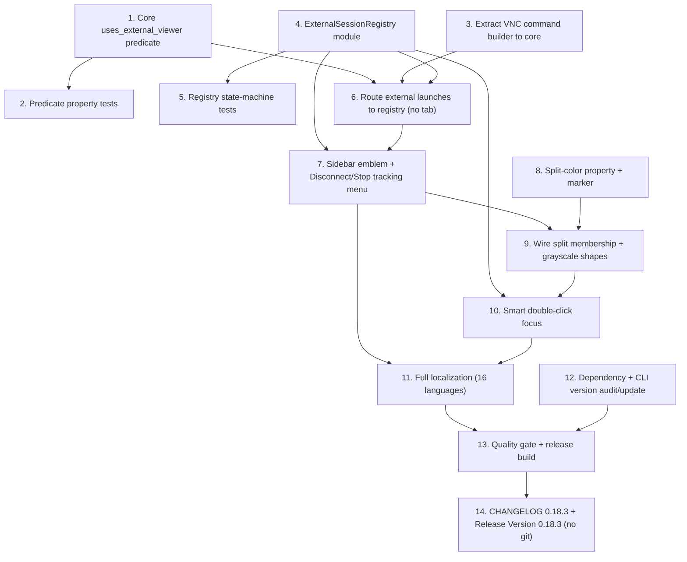

# Implementation Plan

## Overview

Release 0.18.3. Phase 1 (tasks 1–7) is the shippable #209 fix: a GUI-free predicate, an `ExternalSessionRegistry` with a shared poll timer, launch-path integration that suppresses the dead tab, and a sidebar emblem plus Disconnect / Stop tracking menu. Phase 2 (tasks 8–10) adds the UX layer: a split-color marker, grayscale-distinct indicators, and a smart double-click that focuses an existing session. Release tasks (11–14) cover full localization for all 16 languages, a dependency and CLI-version audit, the CHANGELOG 0.18.3 entry, and the full version-sync release for 0.18.3 — all without git commands. Keep the crate boundary: pure decision logic in `rustconn-core` (GUI-free), everything GTK/process in `rustconn`.

## Task Dependency Graph



```json
{
  "waves": [
    { "wave": 1, "tasks": ["1", "3", "4", "8"] },
    { "wave": 2, "tasks": ["2", "5", "6"] },
    { "wave": 3, "tasks": ["7"] },
    { "wave": 4, "tasks": ["9", "10"] },
    { "wave": 5, "tasks": ["11", "12"] },
    { "wave": 6, "tasks": ["13"] },
    { "wave": 7, "tasks": ["14"] }
  ]
}
```

## Tasks

### Phase 1 — External viewer sessions without a dead tab (closes #209)

- [x] 1. Add the GUI-free `uses_external_viewer` predicate in rustconn-core
  - Implement `Connection::uses_external_viewer(&self) -> bool` in `rustconn-core/src/models/connection.rs` (SPICE always true; VNC/RDP true when `window_mode == External` or protocol `client_mode == External`; all other protocols false).
  - Keep it `#[must_use]`, pure, no I/O; no gtk4/adw/vte4 tokens.
  - _Requirements: 1.2, 1.3, 8.1_

- [x] 2. Property/unit tests for the predicate (rustconn-core)
  - Add tests covering Properties 1–3: determinism across repeated calls, SPICE always external, non-graphical never external, and the VNC/RDP window_mode/client_mode matrix.
  - Place in the `rustconn-core` property_tests suite (no GTK).
  - _Requirements: 1.1, 1.2, 8.1_

- [x] 3. Extract external VNC command building into rustconn-core
  - Move/extend the VNC external argument construction (currently `build_server_address` / viewer arg logic in `rustconn/src/session/vnc.rs`) into `rustconn-core` (reuse/extend `VncProtocol::build_command`) so a `std::process::Command` can be built without a GTK widget.
  - Update `session/vnc.rs::spawn_external_viewer_with_config` to call the shared builder (single source of truth), leaving its fallback behavior intact.
  - _Requirements: 1.3, 8.1_

- [x] 4. Create the `ExternalSessionRegistry` module (rustconn)
  - New file `rustconn/src/external_session.rs` with `ExternalSession`, `ExternalSessionCallbacks`, and `ExternalSessionRegistry` per the design.
  - Implement `register`, `stop_tracking`, `disconnect` (owned-only kill with 5 s try_wait budget + `// ponytail:` note), `has_active_session`, `active_session_ids`.
  - Implement the single shared 2 s `glib::timeout_add_local` poll: on child exit fire `on_ended` exactly once and remove the entry; return `ControlFlow::Break` when no owned children remain; restart on `register` via a `timer_running` guard.
  - Never auto-close `child: None` (detaching) sessions.
  - Wire the registry into `MainWindow` construction with callbacks that call `increment_session_count`/`record_connection_start` (on_registered) and `decrement_session_count`/`record_connection_end`/`set_external_session(false)` (on_ended).
  - _Requirements: 2.1, 2.5, 2.6, 2.7, 3.1, 3.2, 3.3, 3.4, 3.5, 4.1, 4.2, 4.3, 4.4, 4.5, 4.6, 4.7, 5.2, 5.3, 5.4, 5.7_

- [x] 5. Add unit tests for the registry state machine (rustconn)
  - Cover Properties 6–8: `stop_tracking` marks ended without kill; `disconnect` returns false and does nothing for `child: None`; `on_ended` fires exactly once per process; timer stops when empty and restarts on register. Use a short-lived spawned process (e.g. `sleep`) for owned-child cases; no GTK.
  - _Requirements: 4.3, 4.4, 4.6, 4.7, 5.3, 5.5_

- [x] 6. Route external-viewer launches to the registry (suppress the tab)
  - In `rustconn/src/window/protocols.rs::start_vnc_connection_internal` and the duplicate VNC path in `rustconn/src/window/rdp_vnc.rs`: when `conn.uses_external_viewer()`, spawn the viewer via the core builder, `registry.register(...)`, and skip `create_vnc_session_tab`.
  - In `rustconn/src/window/rdp_vnc.rs::start_external_rdp_session`: register the `RdpLauncher` process handle and remove `add_embedded_session_tab` + the per-tab 2 s monitor (superseded by the shared timer).
  - In `rustconn/src/window/protocols.rs::start_spice_connection_internal`: spawn + register, no tab (SPICE args already in rustconn-core).
  - Leave `start_embedded_rdp_session` and embedded VNC unchanged; keep the R1.4 runtime-fallback placeholder path intact.
  - On spawn failure: no tab + error toast via `crate::toast::show_error_toast_on_active_window`.
  - _Requirements: 1.1, 1.3, 1.4, 1.5, 1.6, 3.1_

- [x] 7. Sidebar external-viewer emblem + Disconnect / Stop tracking menu
  - Add an `external_session: bool` property to `ConnectionItem` (imp module in `rustconn/src/sidebar/mod.rs`) mirroring `is_recording`; add `ConnectionSidebar::set_external_session(id, bool)`.
  - In `rustconn/src/sidebar/view.rs` render a `window-new-symbolic` emblem next to `status-icon`, reactive on `notify::external-session`, with an `i18n()` accessible label; keep the green connected icon alongside it.
  - Add `has_external_session` param to `sidebar_ui::show_context_menu_for_item` and thread it through `show_context_menu_for_connection_item` (read `item.external_session()`); insert "Disconnect" (primary), "Stop tracking" (before Delete) in GNOME HIG order.
  - Wire `win.external-disconnect` / `win.external-stop-tracking` actions resolving the connection's active session via the registry; not-owned Disconnect shows an informational toast.
  - _Requirements: 2.2, 2.3, 2.4, 5.1, 5.5, 5.6, 8.2_

### Phase 2 — Existing-session indication and smart double-click

- [x] 8. Split-color property and sidebar marker
  - Add `split_color: i32` (-1 = none) property to `ConnectionItem` and `ConnectionSidebar::set_split_color(id, Option<usize>)`.
  - In `rustconn/src/sidebar/view.rs` render a small filled-square marker reactive on `notify::split-color`, colored via a per-index CSS class (add classes in `rustconn/src/sidebar_types.rs`, reusing the split color palette).
  - _Requirements: 6.2_

- [x] 9. Wire split membership to the sidebar and ensure grayscale-distinct shapes
  - Update `set_split_color` when a session joins/leaves a split, sourced from `notebook.split_colors()` (`rustconn/src/terminal/mod.rs`); clear on split removal.
  - Verify the three indicators (connected check, external window emblem, split square) use distinct shapes and remain distinguishable in grayscale, and can coexist on one row.
  - _Requirements: 6.1, 6.3, 6.4, 6.5_

- [x] 10. Smart double-click that focuses an existing session
  - In `rustconn/src/window/mod.rs` change `connect_at_position_with_split`: resolve live sessions for the connection (`notebook.get_all_sessions()` filtered by connection_id + `registry.active_session_ids`).
  - One embedded session → select owner tab and, if in a split (`session_split_bridges`), `SplitViewBridge::focus_pane` + grab focus; multiple → focus most recent; zero → launch new.
  - Add a capture-phase `GestureClick` on the list view to capture the Shift/Ctrl modifier; modifier or the "Open new session" menu item forces a new session; add `win.open-new-session` action.
  - External-only connection → no duplicate; show an "already running in an external window" toast (modifier still forces new). Handle the vanished-session race by launching new.
  - _Requirements: 7.1, 7.2, 7.3, 7.4, 7.5, 7.6_

### Release — 0.18.3

- [x] 11. Full localization for all 16 languages
  - Collect every new UI string added in tasks 6–10 ("Disconnect", "Stop tracking", "Open new session", the external-viewer emblem accessible label, the "already running in an external window" toast, and any error/placeholder strings).
  - Run `bash po/update-pot.sh`, then `msgmerge --update` each of the 16 `.po` files (be, cs, da, de, es, fr, it, kk, nl, pl, pt, sk, sv, uk, uz, zh-cn).
  - Provide actual translations for the new msgids in ALL 16 languages (not empty stubs); for uk, run the `uk-translation-reviewer` sub-agent to review/correct `po/uk.po` per the Ukrainian style guide.
  - Verify no leftover `fuzzy`/empty entries for the new strings and that each `.po` still compiles (`msgfmt -c`).
  - _Requirements: 8.2, 8.3_

- [x] 12. Dependency and CLI-version audit/update
  - Cargo: `cargo update --dry-run` then `cargo update`; rebuild and confirm compilation; note significant bumps for the CHANGELOG `### Dependencies` line. Run `cargo deny check` (supply-chain/license) and resolve any new advisories.
  - CLI downloads: run `./scripts/check-cli-versions.sh`; for each outdated component update `pinned_version` / `download_url` / `aarch64_url` / `checksum` in `rustconn-core/src/cli_download.rs` and record under CHANGELOG `### Changed` (`CLI downloads — ...`).
  - Only apply updates that build clean; record what was updated (and what was intentionally held back).
  - _Requirements: 8.5_

- [x] 13. Quality gate and release build
  - Run the `rust-quality-check` sub-agent: `cargo fmt --check`, `cargo clippy --all-targets` (0 warnings), `cargo test --workspace` (~120 s, timeout 180 s), then `cargo build --release`.
  - Confirm `Cargo.lock` is updated by task 12 and included.
  - Manual matrix for #209: VNC External, RDP External, SPICE → no tab, sidebar green + emblem, viewer close clears state within 2 s, Disconnect and Stop tracking behave per spec; double-click focuses instead of duplicating.
  - _Requirements: 8.5, 8.6_

- [x] 14. CHANGELOG 0.18.3 and Release Version 0.18.3 (no git commands)
  - Write the `## [0.18.3] - YYYY-MM-DD` CHANGELOG.md entry: `### Added` (external-session tracking, sidebar emblem, smart double-click), `### Fixed` (#209 dead tab for VNC/RDP/SPICE External), `### Improved` (orthogonal sidebar indicators), `### Changed` (CLI downloads if any from task 12), `### Dependencies` (from task 12).
  - Bump version to 0.18.3 and sync it across ALL packaging files per the release workflow: `Cargo.toml` `[workspace.package] version`, `docs/USER_GUIDE.md`, `docs/ARCHITECTURE.md`, `debian/changelog`, `packaging/obs/{debian.changelog,rustconn.changes,rustconn.spec,rustconn.dsc,debian.dsc,AppImageBuilder.yml}`, `packaging/flatpak/*.yml` and `packaging/flathub/*.yml` (`tag: v0.18.3`, do NOT touch `*.local.yml`), `rustconn/assets/io.github.totoshko88.RustConn.metainfo.xml` (new `<release>` at top), and `snap/snapcraft.yaml`.
  - Convert the CHANGELOG entry into each packaging format (Debian, RPM `.changes`/`.spec`, metainfo XML — strip markdown, escape XML entities) as described in the release workflow.
  - Run the version-sync check (`grep -r "0.18.3" ...`) so every file listed in the release checklist contains 0.18.3.
  - Do NOT run any git command (no commit, tag, or push) — stop after files are updated and synced.
  - _Requirements: 8.3, 8.7_

## Notes

- **Crate boundary:** only task 1 and task 3 touch `rustconn-core`, and both must stay GUI-free (no gtk4/adw/vte4). All widget, process, and registry code lives in `rustconn`.
- **Phase 1 is independently shippable** as the #209 fix; Phase 2 can follow in the same release once Phase 1 verifies clean.
- **Testing:** GTK widgets are not unit-tested per project convention; the core predicate (task 2) and registry state machine (task 5) carry the automated coverage. The manual matrix in task 13 covers GUI behavior.
- **No persisted-model change** — `WindowMode` and protocol `client_mode` already exist, so no settings migration is required.
- **Detaching viewers** (remmina/krdc/some remote-viewer) register with `child: None`; they rely on "Stop tracking" and are never auto-closed by the poll timer.
- **Release without git (task 14):** the release workflow's final `git tag`/`push` steps are intentionally omitted per request — all edits are file-level only, ready for a manual git step later.
- **Release file map** — full list and per-file formats live in the `rustconn` power steering `release.md`; task 14 follows it exactly except the git steps.
