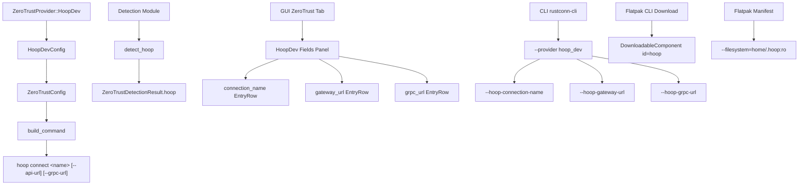

# Дизайн-документ: Hoop.dev ZeroTrust Provider

## Огляд

Ця функція додає Hoop.dev як 11-го ZeroTrust-провайдера в RustConn. Hoop.dev — це zero-trust шлюз доступу, що використовує CLI `hoop` для підключення до інфраструктури через `hoop connect <connection-name>` з опціональними параметрами `--api-url` та `--grpc-url`.

Реалізація дотримується існуючих патернів Teleport, Boundary та Tailscale SSH провайдерів і охоплює:
- Модель даних (`HoopDev` варіант, `HoopDevConfig` структура)
- Генерацію команд (`hoop connect <name>`)
- Детекцію CLI (`detect_hoop()`)
- Завантаження CLI для Flatpak (`DownloadableComponent`)
- GUI-поля у діалозі ZeroTrust
- CLI-підтримку (`rustconn-cli`)
- Flatpak-дозволи (`~/.hoop:ro`)
- Серіалізацію/десеріалізацію (round-trip)
- Property-тести

## Архітектура

Інтеграція Hoop.dev слідує тій самій архітектурі, що й інші ZeroTrust-провайдери:



### Потік даних

1. Користувач обирає `Hoop.dev` у dropdown провайдерів (GUI) або передає `--provider hoop_dev` (CLI)
2. Заповнює `connection_name` (обов'язково), `gateway_url` та `grpc_url` (опціонально)
3. `ZeroTrustConfig` зберігає `ZeroTrustProviderConfig::HoopDev(HoopDevConfig {...})`
4. При підключенні `build_command()` генерує `("hoop", ["connect", "<name>", ...])`
5. Команда виконується у вбудованому терміналі

## Компоненти та інтерфейси

### 1. Модель даних (`rustconn-core/src/models/protocol.rs`)

**Зміни в `ZeroTrustProvider` enum:**
- Додати варіант `HoopDev` з `#[serde(rename = "hoop_dev")]`
- Позиція: перед `Generic` у `all()`, після `Boundary`
- `display_name()` → `"Hoop.dev"`
- `icon_name()` → `"network-transmit-symbolic"` (унікальна іконка, не дублює існуючі)
- `cli_command()` → `"hoop"`

**Нова структура `HoopDevConfig`:**

```rust
#[derive(Debug, Clone, PartialEq, Eq, Serialize, Deserialize)]
pub struct HoopDevConfig {
    pub connection_name: String,
    #[serde(skip_serializing_if = "Option::is_none")]
    pub gateway_url: Option<String>,
    #[serde(skip_serializing_if = "Option::is_none")]
    pub grpc_url: Option<String>,
}
```

**Зміни в `ZeroTrustProviderConfig` enum:**
- Додати варіант `HoopDev(HoopDevConfig)` перед `Generic`

### 2. Генерація команд (`ZeroTrustConfig::build_command()`)

Новий match-arm у `build_command()`:
```rust
ZeroTrustProviderConfig::HoopDev(cfg) => {
    let mut a = vec!["connect".to_string(), cfg.connection_name.clone()];
    if let Some(ref url) = cfg.gateway_url {
        if !url.is_empty() {
            a.push("--api-url".to_string());
            a.push(url.clone());
        }
    }
    if let Some(ref url) = cfg.grpc_url {
        if !url.is_empty() {
            a.push("--grpc-url".to_string());
            a.push(url.clone());
        }
    }
    ("hoop".to_string(), a)
}
```

Custom args додаються автоматично загальним кодом після match-блоку (як для всіх не-Generic провайдерів).

### 3. Валідація (`ZeroTrustConfig::validate()`)

Новий match-arm за патерном `Boundary`:
```rust
ZeroTrustProviderConfig::HoopDev(cfg) => {
    if cfg.connection_name.trim().is_empty() {
        return Err(ProtocolError::InvalidConfig(
            "Hoop.dev connection name cannot be empty".into(),
        ));
    }
}
```

Тільки `connection_name` є обов'язковим. `gateway_url` та `grpc_url` — опціональні.

### 4. Детекція CLI (`rustconn-core/src/protocol/detection.rs`)

Нова функція `detect_hoop()` за патерном `detect_boundary()`:
```rust
pub fn detect_hoop() -> ClientInfo {
    detect_client("Hoop.dev", "hoop", &["version"], "Install: https://hoop.dev/docs/installing")
}
```

Зміни в `ZeroTrustDetectionResult`:
- Додати поле `pub hoop: ClientInfo`
- `detect_all()`: додати `hoop: detect_hoop()`
- `as_vec()`: додати `&self.hoop`

### 5. Завантаження CLI для Flatpak (`rustconn-core/src/cli_download.rs`)

Новий `DownloadableComponent` у масиві `DOWNLOADABLE_COMPONENTS`, після `boundary`:
```rust
DownloadableComponent {
    id: "hoop",
    name: "Hoop.dev",
    description: "For Hoop.dev access",
    category: ComponentCategory::ZeroTrust,
    install_method: InstallMethod::Download,
    download_url: Some(
        "https://releases.hoop.dev/release/latest/hoop_latest_linux_amd64.tar.gz",
    ),
    aarch64_url: Some(
        "https://releases.hoop.dev/release/latest/hoop_latest_linux_arm64.tar.gz",
    ),
    checksum: ChecksumPolicy::SkipLatest,
    pip_package: None,
    size_hint: "~30 MB",
    binary_name: "hoop",
    install_subdir: "hoop",
    pinned_version: None,
    works_in_sandbox: true,
}
```

### 6. GUI-поля (`rustconn/src/dialogs/connection/zerotrust.rs`)

Нова функція `create_hoop_dev_fields()` за патерном `create_boundary_fields()`:
- `connection_name`: обов'язкове `adw::EntryRow` з label `i18n("Connection Name")` та placeholder `i18n("e.g., my-database")`
- `gateway_url`: опціональне `adw::EntryRow` з label `i18n("Gateway URL")` та placeholder `i18n("e.g., https://app.hoop.dev")`
- `grpc_url`: опціональне `adw::EntryRow` з label `i18n("gRPC URL")` та placeholder `i18n("e.g., grpc.hoop.dev:8443")`

Зміни в `create_zerotrust_options()`:
- Додати `"Hoop.dev"` у dropdown перед `"Generic Command"`
- Додати поля до `ZeroTrustOptionsWidgets` tuple

Зміни в `dialog.rs`:
- Маппінг індексу dropdown ↔ `ZeroTrustProvider::HoopDev` (індекс 9, Generic стає 10)
- Збирання `HoopDevConfig` з полів при збереженні
- Заповнення полів при відкритті існуючого з'єднання

### 7. CLI підтримка (`rustconn-cli/`)

Зміни в `show.rs`:
- Додати відображення `HoopDev`-специфічних полів у match-блоці `protocol_config`

Зміни в `connect.rs`:
- `build_zerotrust_command()` вже делегує до `ZeroTrustConfig::build_command()`, тому HoopDev підтримується автоматично

### 8. Flatpak-дозволи

Додати до всіх трьох маніфестів після рядка `--filesystem=home/.kube:ro`:
```yaml
# Hoop.dev CLI config and access tokens
- --filesystem=home/.hoop:ro
```

Файли:
- `packaging/flatpak/io.github.totoshko88.RustConn.yml`
- `packaging/flatpak/io.github.totoshko88.RustConn.local.yml`
- `packaging/flathub/io.github.totoshko88.RustConn.yml`

### 9. Інтернаціоналізація

Всі нові рядки GUI обгортаються в `i18n()` / `i18n_f()`:
- Labels: `"Connection Name"`, `"Gateway URL"`, `"gRPC URL"`
- Placeholders: `"e.g., my-database"`, `"e.g., https://app.hoop.dev"`, `"e.g., grpc.hoop.dev:8443"`
- Validation: `"Hoop.dev connection name cannot be empty"`

Оновити `po/rustconn.pot` через `po/update-pot.sh`.

## Моделі даних

### HoopDevConfig

| Поле | Тип | Обов'язкове | Опис |
|------|-----|-------------|------|
| `connection_name` | `String` | Так | Ідентифікатор з'єднання в Hoop.dev |
| `gateway_url` | `Option<String>` | Ні | URL API-шлюзу (--api-url) |
| `grpc_url` | `Option<String>` | Ні | URL gRPC-сервера (--grpc-url) |

### Зміни в існуючих моделях

**`ZeroTrustProvider` enum** — додати варіант:
```
HoopDev  →  serde: "hoop_dev", display: "Hoop.dev", icon: "network-transmit-symbolic", cli: "hoop"
```

**`ZeroTrustProviderConfig` enum** — додати варіант:
```
HoopDev(HoopDevConfig)
```

**`ZeroTrustDetectionResult` struct** — додати поле:
```
pub hoop: ClientInfo
```

### Серіалізація JSON

Приклад серіалізованої конфігурації з усіма полями:
```json
{
  "provider": "hoop_dev",
  "connection_name": "my-database",
  "gateway_url": "https://app.hoop.dev",
  "grpc_url": "grpc.hoop.dev:8443",
  "custom_args": []
}
```

Коли `gateway_url` та `grpc_url` є `None`, вони не включаються в JSON (через `skip_serializing_if`):
```json
{
  "provider": "hoop_dev",
  "connection_name": "my-database"
}
```


## Correctness Properties

*Властивість (property) — це характеристика або поведінка, яка повинна залишатися істинною для всіх допустимих виконань системи. По суті, це формальне твердження про те, що система повинна робити. Властивості слугують мостом між людино-читабельними специфікаціями та машинно-верифікованими гарантіями коректності.*

### Property 1: HoopDevConfig serialization round-trip

*For any* valid `HoopDevConfig` (з довільним `connection_name`, довільним `Option<String>` для `gateway_url` та `grpc_url`), серіалізація в JSON через `serde_json::to_string` з наступною десеріалізацією через `serde_json::from_str` повинна повернути еквівалентний `HoopDevConfig`.

**Validates: Requirements 2.4, 10.1, 10.2, 10.3, 12.3**

### Property 2: None fields omitted from serialized JSON

*For any* `HoopDevConfig` де `gateway_url` є `None`, серіалізований JSON не повинен містити ключ `"gateway_url"`. Аналогічно, *for any* `HoopDevConfig` де `grpc_url` є `None`, серіалізований JSON не повинен містити ключ `"grpc_url"`.

**Validates: Requirements 2.5**

### Property 3: Validation accepts valid configs and rejects empty connection_name

*For any* `HoopDevConfig`, `ZeroTrustConfig::validate()` повертає `Ok(())` тоді і тільки тоді, коли `connection_name.trim()` не є порожнім. Для будь-якого рядка, що складається виключно з пробільних символів (або порожнього рядка), валідація повинна повернути `Err(ProtocolError::InvalidConfig)`.

**Validates: Requirements 3.1, 3.2**

### Property 4: Command generation correctness

*For any* valid `HoopDevConfig` (де `connection_name` не порожній), `ZeroTrustConfig::build_command()` повинен:
- Повернути `"hoop"` як команду
- Перші два аргументи повинні бути `["connect", connection_name]`
- Якщо `gateway_url` є `Some(url)` і `url` не порожній, аргументи повинні містити `["--api-url", url]`
- Якщо `grpc_url` є `Some(url)` і `url` не порожній, аргументи повинні містити `["--grpc-url", url]`
- Якщо `custom_args` не порожні, вони повинні бути в кінці списку аргументів

**Validates: Requirements 4.1, 4.2, 4.3, 4.4**

### Property 5: Provider icon names are unique

*For all* пар різних варіантів `ZeroTrustProvider` (включаючи `HoopDev`), значення `icon_name()` повинні бути різними. Жоден провайдер не повинен мати іконку, що дублює іконку іншого провайдера.

**Validates: Requirements 1.3, 12.4**

## Обробка помилок

### Помилки валідації
- `ProtocolError::InvalidConfig("Hoop.dev connection name cannot be empty")` — коли `connection_name` порожній або складається з пробілів
- Валідація відбувається при збереженні з'єднання (GUI) та при виконанні підключення (CLI)

### Помилки детекції CLI
- `detect_hoop()` повертає `ClientInfo::not_installed(...)` якщо бінарний файл `hoop` не знайдено в `$PATH`
- Це не блокує створення з'єднання — лише показує попередження в GUI

### Помилки завантаження CLI (Flatpak)
- Стандартна обробка через `DownloadableComponent` — показ прогресу та повідомлення про помилку при невдалому завантаженні
- `ChecksumPolicy::SkipLatest` — контрольна сума не перевіряється для "latest" URL

### Помилки підключення
- Якщо `hoop` CLI не встановлено — помилка запуску процесу з повідомленням про необхідність встановлення
- Якщо `hoop connect` повертає ненульовий код — стандартна обробка через вбудований термінал

## Стратегія тестування

### Двосторонній підхід

Тестування використовує комбінацію unit-тестів та property-based тестів для повного покриття.

### Property-based тести (proptest)

Бібліотека: `proptest` 1.10 (вже використовується в проєкті)
Конфігурація: мінімум 100 ітерацій на тест (`ProptestConfig::with_cases(100)`)

Кожен property-тест повинен мати коментар-тег:
```
// **Feature: hoop-dev-zerotrust, Property {N}: {title}**
// **Validates: Requirements X.Y**
```

**Стратегії генерації:**

1. `arb_hoop_dev_config()` — генерує довільні `HoopDevConfig`:
   - `connection_name`: довільний непорожній рядок `[a-zA-Z0-9_-]{1,50}`
   - `gateway_url`: `Option<String>` — `None` або URL-подібний рядок
   - `grpc_url`: `Option<String>` — `None` або host:port рядок

2. `arb_hoop_command()` — генерує валідні рядки команд `hoop`:
   - `"hoop connect my-db"`, `"hoop connect db --api-url https://app.hoop.dev"`, тощо
   - Додати до `arb_command_with_provider()` з маппінгом на `CloudProvider::HoopDev`

**Property-тести (по одному тесту на кожну property):**

| Property | Тест | Файл |
|----------|------|------|
| P1: Round-trip | `prop_hoop_dev_config_roundtrip` | `detection_tests.rs` |
| P2: None omission | `prop_hoop_dev_none_fields_omitted` | `detection_tests.rs` |
| P3: Validation | `prop_hoop_dev_validation_correctness` | `detection_tests.rs` |
| P4: Command gen | `prop_hoop_dev_command_generation` | `protocol_tests.rs` |
| P5: Icon uniqueness | Існуючий `prop_protocol_icons_are_distinct` | `protocol_tests.rs` |

### Unit-тести

Unit-тести для конкретних прикладів та edge cases:

1. **Серіалізація** (`protocol.rs` unit tests):
   - `test_hoop_dev_serde_rename` — перевірка що serde rename = "hoop_dev"
   - `test_hoop_dev_display_name` — перевірка display_name() = "Hoop.dev"
   - `test_hoop_dev_cli_command` — перевірка cli_command() = "hoop"
   - `test_hoop_dev_in_all` — перевірка що HoopDev є в all() перед Generic

2. **Валідація** (`protocol.rs` unit tests):
   - `test_hoop_dev_validate_empty_name` — порожній connection_name → Err
   - `test_hoop_dev_validate_whitespace_name` — пробільний connection_name → Err
   - `test_hoop_dev_validate_valid` — валідний config → Ok

3. **Генерація команд** (`protocol.rs` unit tests):
   - `test_hoop_dev_build_command_basic` — базова команда без опціональних полів
   - `test_hoop_dev_build_command_with_urls` — команда з gateway_url та grpc_url
   - `test_hoop_dev_build_command_with_custom_args` — команда з custom_args

4. **Детекція** (`detection_tests.rs`):
   - `test_hoop_detection_returns_valid_info` — detect_hoop() повертає валідний ClientInfo

5. **Flatpak компонент** (`cli_download` tests):
   - `test_hoop_downloadable_component` — перевірка полів DownloadableComponent для hoop

6. **Provider detection** (`protocol_tests.rs`):
   - Додати `arb_hoop_command()` до `arb_command_with_provider()` для тестування детекції провайдера за командою
